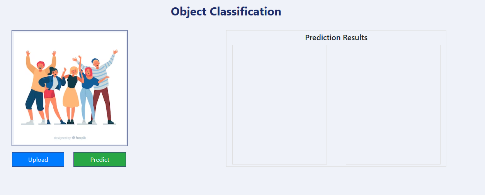
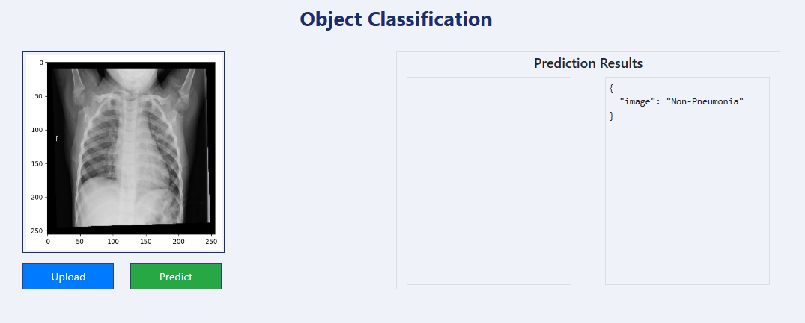

## In this blog, we’ll dive into the entire process of creating a robust pneumonia detection system using deep learning techniques. By the end, we'll have developed and deployed a fully functional web app that can assess whether an uploaded X-ray image shows signs of pneumonia.

**Project Overview**

As an aspiring data scientist, I embarked on a challenging yet rewarding project that involved developing a deep learning model capable of analyzing chest X-ray images to detect signs of pneumonia in children. This blog post outlines the end-to-end process of this project. From dataset analysis to model deployment, this project will culminate to a fully functional, cloud hosted web app where users can upload chest X-rays and have the model's assessment on whether there are signs of pneumonia present.


**Data Understanding**

The project's cornerstone is a dataset of 5,856 pediatric chest X-ray images, generously provided by researchers from the University of California, San Diego. The dataset is available via [this link](https://data.mendeley.com/datasets/rscbjbr9sj/2). The dataset is divided into training and test subsets, with each image labeled to indicate the presence or absence of pneumonia.


**Exploratory Data Analysis**
It seems nearly impossible to discern from the following images which is the patient suffering from pneumonia, and which isn't.

 


**Splitting the Dataset**
Before we can move forward with model training, we'll separate the dataset into three: training, validation, test.

Splitting the dataset into training, validation, and test sets is crucial for evaluating the model’s performance accurately. The training set is used to fit the model, the validation set is for tuning model parameters and preventing overfitting, and the test set serves as an unbiased evaluation of the final model to assess its generalization to new data.


**Model Training and Evaluation** 

Both models underwent rigorous training using the provided dataset. The CNN model served as a baseline, while the VGG16 and ResNet50v2 models, with their sophisticated architecture, promised enhanced accuracy. At the end of initial training, the models are evaluated on the test dataset to assess their predictive capabilities.

The most successful model will be used to further develop a fully functional, Azure deployed web app where users can upload chest X-rays to assess if there are signs of pneumonia present.

The three models will be a simple Convolution Neural Network, VGG16, and ResNet50v2.
Relevant resources
[Keras Applications](https://keras.io/api/applications/#usage-examples-for-image-classification-models) 


1. **The CNN Model**: The first model was a somewhat complex Convolutional Neural Network (CNN), designed to learn patterns directly from the chest X-ray images. It consisted of convolutional layers that could capture the intricate patterns in X-ray images, which are indicative of pneumonia. 

    ```python
    # instantiating model
    cnn_model = models.Sequential()

    # zooming and rotating images
    cnn_model.add(layers.RandomZoom(height_factor=0.15, width_factor=0.15))
    cnn_model.add(layers.RandomRotation(factor=0.2)) #counter clockwise rotation (+/-)20% * 2pi

    cnn_model.add(layers.Conv2D(filters=128, kernel_size=3, strides=2, activation='relu', input_shape=(img_size, img_size, 3)))
    cnn_model.add(layers.MaxPool2D(pool_size=3, strides=2))

    cnn_model.add(layers.Conv2D(filters=64, kernel_size=3, strides=2, activation='relu'))
    cnn_model.add(layers.MaxPool2D(pool_size=3, strides=2))
    cnn_model.add(layers.Flatten())

    cnn_model.add(layers.Dense(32, activation='relu'))
    cnn_model.add(layers.Dropout(0.5))

    cnn_model.add(layers.Dense(16, activation='relu'))
    cnn_model.add(layers.Dropout(0.5))

    cnn_model.add(layers.Dense(2))

    # early stopping callback if val_loss continuously increases after 3 periods
    early_stopping_callback = tf.keras.callbacks.EarlyStopping(monitor='val_loss', patience=3, restore_best_weights=True)

    opt = tf.keras.optimizers.Adam(learning_rate=0.01)
    loss = tf.keras.losses.CategoricalCrossentropy(from_logits=True)
    cnn_model.compile(optimizer=opt, loss=loss, metrics=['accuracy'])

    cnn_model.build((None, img_size, img_size, 3))

    cnn_model.summary()

    cnn_model.fit(train_set_normalized, epochs=10, validation_data=validation_set_normalized, callbacks=[early_stopping_callback])
    ```
    
    The implementation begins with data augmentation layers that introduce variability into the training dataset, enhancing the model's ability to generalize from the data. At random, a set number of images will either be [zoomed in/out](https://www.tensorflow.org/api_docs/python/tf/keras/layers/RandomZoom) or [rotated](https://www.tensorflow.org/api_docs/python/tf/keras/layers/RandomRotation).

    Subsequent convolutional layers (`layers.Conv2d`), designed with a stride of two, reduce dimensionality while capturing spatial hierarchies. 
    
    Pooling layers further condense the feature maps, leading to a flattened layer that transitions to a series of dense layers. These dense layers culminate in a binary classification output. The model employs dropout regularization to mitigate overfitting and an early stopping callback to prevent unnecessary computations if the validation loss does not improve, ensuring efficient training. The optimizer and loss function are carefully chosen to steer the learning process.

    ```
    Total params: 538,770
    Trainable params: 538,770
    Non-trainable params: 0
    ```
    Training and validation accuracy scores 
    ```
    CNN training set accuracy:
    [0.69756, 0.73698, 0.73698, 0.73698, 0.73698, 0.73817, 0.74224, 0.73531, 0.74009, 0.73579]

    CNN validation set accuracy:
    [0.76291, 0.76291, 0.76291, 0.76291, 0.76291, 0.76291, 0.76291, 0.76291, 0.76291, 0.76291]

    Though the model wasn't able to achieve accuracies scores north of 74.4% and 76.3% for training and validation datasets, respectively, those are comparably much better results than what we would expect by simple random chance.


2. **VGG16**: The second model developed leverages a pre-trained VGG16 model, renowned for its proficiency in image recognition tasks, to identify pneumonia from chest X-ray images. The VGG16 architecture was chosen due to its simplicity and effectiveness, which makes it an excellent starting point for transfer learning. 

    ```python
    vgg16_model = applications.vgg16.VGG16(
        include_top=False,
        weights='imagenet',
        input_shape=(img_size, img_size, 3)
    )

    vgg16_model.trainable = False

    input_layer = Input(shape=(img_size, img_size, 3))

    # input layers
    preprocessed_input_layer = applications.vgg16.preprocess_input(input_layer)

    # random zoom and rotation of images
    preprocessed_input_layer = layers.RandomZoom(height_factor=0.1)(preprocessed_input_layer)
    preprocessed_input_layer = layers.RandomRotation(factor=0.2)(preprocessed_input_layer)

    features_layer = vgg16_model(preprocessed_input_layer, training=False)

    global_pooling = layers.GlobalAveragePooling2D()(features_layer)

    # fully connected layers
    fc1 = layers.Dense(512)(global_pooling)
    fc1 = layers.ReLU()(fc1)
    fc1 = layers.Dropout(0.5)(fc1)

    fc2 = layers.Dense(128)(fc1)
    fc2 = layers.ReLU()(fc2)
    fc2 = layers.Dropout(0.5)(fc2)

    fc3 = layers.Dense(32)(fc2)
    fc3 = layers.ReLU()(fc3)

    # output layer
    output = layers.Dense(2)(fc3)

    vgg16 = Model(inputs=input_layer, outputs=output)

    vgg16.summary()

    early_stopping_callback = tf.keras.callbacks.EarlyStopping(monitor='val_loss', patience=2, restore_best_weights=True)
    opt = tf.keras.optimizers.Adam(learning_rate=0.01)
    loss=tf.keras.losses.CategoricalCrossentropy(from_logits=True)
    vgg16.compile(optimizer=opt, loss=loss, metrics=['accuracy'])

    vgg16.fit(train_set, epochs=10, validation_data=validation_set, callbacks=[early_stopping_callback])
    ```
    
    By setting `trainable=False`, we froze the weights inherited from the 'imagenet' dataset, ensuring that the intricate patterns learned previously could be applied to our specific medical imaging task without running the risk of overfitting. As in our CNN model, the inclusion of random zoom and rotation in the preprocessing phase introduced necessary variability, simulating a more realistic set of images that a model might encounter in a clinical setting. 

    The model's performance was bolstered by a series of densely connected layers, culminating in a binary classification output. The training process was carefully monitored with an early stopping callback to prevent overtraining, and the optimization was handled by an Adam optimizer with a learning rate of 0.01. The categorical crossentropy loss function was appropriate for this two-class problem.

    ```
    Total params: 15,047,202
    Trainable params: 332,514
    Non-trainable params: 14,714,688
    ```

    And the accuracy scores for the training and validation datasets.

    ```
    VGG16 training accuracy:
    [0.65576, 0.76613, 0.88247, 0.91376, 0.92403, 0.92857]

    VGG16 validation set accuracy:
    [0.76291, 0.89484, 0.91969, 0.93308, 0.89771, 0.90822]
    ```

    Peaking at close to 93%, the model achieved commendable training accuracy, showing a consistent improvement across epochs. The model performed similarly on the validation dataset, also indicating a reliable generalization to unseen data. This suggests that the model could be a valuable tool for assisting medical professionals in the preliminary screening for pneumonia.


3. **The Transfer Learning Model with ResNet50v2**: The third model leverages the ResNet50v2 architecture. Renowned for its deep residual learning framework, it was good candidate in tackling the task of pneumonia detection from chest x-rays images.

    The model was initialized with weights from ImageNet to utilize the power of transfer learning, which is particularly beneficial when dealing with medical imagery due to the complexity and variability of the data. 
    
    ```python
    rn50_v2_model = applications.resnet_v2.ResNet50V2(
        include_top=False,
        weights='imagenet',
        input_shape=(img_size, img_size, 3)
    )

    rn50_v2_model.trainable = False

    input_layer = Input(shape=(img_size, img_size, 3))

    # input layers
    preprocessed_input_layer = applications.resnet_v2.preprocess_input(input_layer)

    # random zoom and rotation of images
    preprocessed_input_layer = layers.RandomZoom(height_factor=0.1)(preprocessed_input_layer)
    preprocessed_input_layer = layers.RandomRotation(factor=0.2)(preprocessed_input_layer)

    features_layer = rn50_v2_model(preprocessed_input_layer, training=False)

    global_pooling = layers.GlobalAveragePooling2D()(features_layer)

    # fully connected layers
    fc1 = layers.Dense(512)(global_pooling)
    fc1 = layers.ReLU()(fc1)
    fc1 = layers.Dropout(0.5)(fc1)

    fc2 = layers.Dense(128)(fc1)
    fc2 = layers.ReLU()(fc2)
    fc2 = layers.Dropout(0.5)(fc2)

    fc3 = layers.Dense(32)(fc2)
    fc3 = layers.ReLU()(fc3)

    # output layer
    output = layers.Dense(2)(fc3)

    rn50_v2 = Model(inputs=input_layer, outputs=output)

    rn50_v2.summary()

    early_stopping_callback = tf.keras.callbacks.EarlyStopping(monitor='val_loss', patience=2, restore_best_weights=True)
    opt = tf.keras.optimizers.Adam(learning_rate=0.01)
    loss=tf.keras.losses.CategoricalCrossentropy(from_logits=True)
    rn50_v2.compile(optimizer=opt, loss=loss, metrics=['accuracy'])

    rn50_v2.fit(train_set, epochs=10, validation_data=validation_set, callbacks=[early_stopping_callback])
    ```

    Same as before in our VGG16 implementation, the ResNet50v2's convolutional base (and its pre-learned features) are preserved, leaving us to simply focus the training on the newly added layers. To remain consistent so to better compare the two transfer learning models, layers are also zoomed and rotated at random, global average pooling is added, and several densely connected layers with ReLU activation and dropout are included to prevent overfitting. The model was compiled with an Adam optimizer and categorical crossentropy loss, and trained with early stopping to ensure optimal generalization. 
    ```
    Total params: 24,683,746
    Trainable params: 1,118,946
    Non-trainable params: 23,564,800
    ```
    As for the accuracies in training and validation datasets

    ```
    ResNet50v2 training accuracy:
    [0.6861, 0.86694, 0.91878, 0.93407, 0.93813, 0.9386]

    ResNet50v2 validation set accuracy:
    [0.91109, 0.9283, 0.90822, 0.94455, 0.94455, 0.93117]
    ``` 
    The training process yielded a steady increase in accuracy, peaking at 93.8% on the training set. Validation accuracy also showed promising results, with a high of 94.4%, indicating the model's robustness and potential for real-world application in diagnosing pneumonia. 

Upon comparison, the ResNet50v2 model emerged as the superior performer, exhibiting higher accuracy and precision. 

With initial research completed, the next step was to implement our approach into a web application. The goal of the app is provide a user-friendly interface where individuals can upload chest X-ray images and receive an immediate analysis indicating potential signs of pneumonia. 


**Modularization**

In our initial approach, we developed the prototype within a Jupyter notebook, which allowed for an interactive exploration and iterative refinement of our machine learning model. Subsequently, we modularized the codebase to ensure a seamless transition into a fully functional cloud-based web application, catering to scalable, real-world deployment needs.

This moduralization can be reviewed by visiting [this project's Github repository.](https://github.com/jcarmfran/Pneumonia-Detection).


**Deployment and Trial** 

Utilizing Github Actions to manage our CICD pipeline, the application was deployed to AWS as a web app.  For more information on how this process took place, and what steps were required, feel free to reference the projects [README.md](https://github.com/jcarmfran/Pneumonia-Detection/blob/main/README.md) file.

Below shows a local launching of the application and user facing interface.



The user can upload an x-ray image and have the application assess whether the patient may be suffering from pneumonia. In our case, we will upload a non-pneumonia x-ray from our dataset to check on the applications prediction power.



As we can see above, the application was able to correctly assess that the patient was not affected by pneumonia. Our application is working as expected.

**Conclusion** 

As we conclude this practical, it's important to emphasize that the deep learning tool we've developed is not intended to replace the expertise and critical judgment of medical professionals in diagnosing pneumonia. Rather, it is designed to be an aid that supports and empowers healthcare providers, giving them a robust tool that can help them proceed with confidence towards the appropriate treatment. 

This project has shed light on the significant role that AI and ML can play in enhancing medical diagnostics. The open-source community's collaborative efforts have been crucial in creating a tool that stands to make early detection of pneumonia more accessible, potentially improving patient outcomes. This is a step forward in medical technology, where deep learning models serve as valuable assistants in the complex field of medical imaging.

For those interested in exploring the technical intricacies of the models or replicating the project, the dataset and TensorFlow documentation provide valuable resources to commence this journey into AI-driven healthcare solutions.  

 - Dataset: [Courtesy of University of California, San Diego](https://data.mendeley.com/datasets/rscbjbr9sj/2)
 - TensorFlow: [TensorFlow/Keras](https://www.tensorflow.org/api_docs/python/tf/keras)

If you’re passionate about advancing healthcare through machine learning, please consider contributing to the [public GitHub repository](https://github.com/jcarmfran/Pneumonia-Detection). I also invite you to share your thoughts and insights in the comment section below.

Whether it’s enhancing the model, improving documentation, or sharing your thoughts, your contributions are very much appreciated!


*Edits:
 - 4/23/24: Added code snippets and expanded conclusion section.
 - 4/24/24: Added modular code and application deployment section.
 - 4/25/24: Corrected typos in **Moduralization** section.

*Disclaimer: The web application is intended for educational purposes and should not replace professional medical advice, diagnosis, or treatment.* 