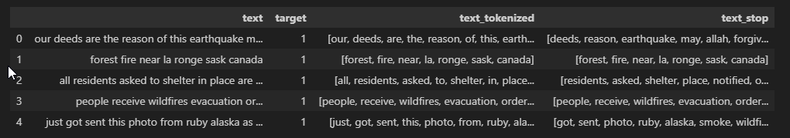

## Classifying Disaster-Related Tweets as Real or Fake

We're interested in monitoring and analyzing news on social media platforms to look for misinformation. One such platform that has proven to become an important communication channel in times of emergency is *X* (formerly known as Twitter).

We've been tasked with building a **deep learning text classification model** that predicts which "Tweets" are about real disasters and which aren't.

## Loading the Data
The first five rows of our dataset:

```
id  keyword  location	text	                                            target
1   NaN	     NaN	    Our Deeds are the Reason of this #earthquake M...	1
4   NaN	     NaN	    Forest fire near La Ronge Sask. Canada	1
5   NaN	     NaN	    All residents asked to 'shelter in place' are ...	1
6   NaN	     NaN	    13,000 people receive #wildfires evacuation or...	1
7   NaN	     NaN	    Just got sent this photo from Ruby #Alaska as ...	1
```

```
Data columns (total 5 columns):
 #   Column    Non-Null Count  Dtype 
---  ------    --------------  ----- 
 0   id        7613 non-null   int64 
 1   keyword   7552 non-null   object
 2   location  5080 non-null   object
 3   text      7613 non-null   object
 4   target    7613 non-null   int64 
```
## Exploratory Data Analysis

### Dropping Unnecessary Columns

In reality, columns `id`, `keyword`, and `location` don't provide much information. Coupled with the fact that two of the columns have missing values (`keyword` and `location`), we'll move forward with our analysis without them.

The dataset following the column dropping:
```
                                             text  target
Our Deeds are the Reason of this #earthquake M...       1
Forest fire near La Ronge Sask. Canada       1
All residents asked to 'shelter in place' are ...       1
13,000 people receive #wildfires evacuation or...       1
Just got sent this photo from Ruby #Alaska as ...       1
```
When analyzing the proportion of the relative to their classification, we see that there more non-disaster related tweets in our dataset than actual disaster tweets.


Relative to each other, about 57% of the dataset consists of non-disaster related tweets. This isn't such a large discrepancy to warrant more data insertion, but it is worth keeping in mind as we continue with our analysis.

### Text Preprocessing

Preprocessing is crucial for preparing the tweet text for analysis and machine learning tasks. We'll restructure the text with the following points in mind: 

- **Formatting**: Standardize the text format for consistency.
- **Cleaning**: Remove noise such as special characters, URLs, and irrelevant punctuation.
- **Tokenization**: Break down the text into individual words or tokens.
- **Further Steps**: Apply additional processing like stemming or lemmatization if necessary.

Following the lowering of the string characters in the texts and removing all characters but the letters (a-z),  we're left with the following:

```
                                                text  target
0  our deeds are the reason of this  earthquake m...       1
1             forest fire near la ronge sask  canada       1
2  all residents asked to  shelter in place  are ...       1
3         people receive  wildfires evacuation or...       1
4  just got sent this photo from ruby  alaska as ...       1
```

With this mostly "naked" set of text strings, we'll move forward with tokenization. 

Post tokenization:


In stopword trimming...

NLTK library was utilized ("punkt", "stopwords", "wordnet", "omw-1.4")
Post stopword trimming:



Post trimming:


Post lemmatization:


After all of the necessary preprocessing, the dataset has reached six columns and includes the outcomes of every step taken.


### Visualizing with WordCloud


## Building Models

Following the splitting of the datasets into training and test sets, the following  observe their 

#### *Model 1: Shallow Neural Network*

Setting a quick benchmark, a shallow neural network is built with two primary layers in mind: a vectorizer and embedding layer.

A crucial component for processing text data in natural language processing tasks, the vectorizer prepares text data by converting it into integer sequences. 

```python
max_tokens = 7500
output_sequence_length = 128
output_dim = 128

vectorizer_layer = TextVectorization(max_tokens=max_tokens,
                                     output_mode='int',
                                     standardize='lower_and_strip_punctuation',
                                     ngrams=1,
                                     output_sequence_length=output_sequence_length)
vectorizer_layer.adapt(X_train)

```
- **Max Tokens**: It specifies the maximum number of unique tokens (words or subwords) to consider during tokenization. In this case, we limit it to 7500 tokens.
- **Output Mode**: The output_mode is set to `int`, which means the vectorizer will convert text into integer sequences.
- **Standardization**: The standardize parameter ensures that all text is converted to lowercase and punctuation is stripped.
- **N-grams**: The `ngrams` parameter controls the creation of n-grams (contiguous sequences of n tokens). Here, we use unigrams (single tokens).
- **Output Sequence Length**: The `output_sequence_length` determines the fixed length of the output sequences after padding or truncation.
- **Adaptation**: The `vectorizer_layer.adapt(X_train)` adapts the vectorizer to the training data `X_train`, learning the vocabulary and other settings.

The embedding layer maps these integer sequences to dense vectors of fixed dimensions, facilitating further processing in machine learning models.

```python
embedding_layer = Embedding(input_dim=max_tokens,
                            output_dim=output_dim,
                            input_length=output_sequence_length)
```

- **Input Dimension (Input Tokens)**: The `input_dim` corresponds to the number of unique tokens (vocabulary size) in our dataset (7500).
- **Output Dimension (Embedding Size)**: The `output_dim` specifies the dimensionality of the dense vector space in which words will be embedded. In this case, it’s set to 128.
- **Input Length**: The `input_length` parameter defines the length of input sequences (number of tokens). For consistency, it matches the output_sequence_length (128).


```python
simple_lstm = Sequential()
simple_lstm.add(Input(shape=(1,), dtype=tf.string))
simple_lstm.add(vectorizer_layer)
simple_lstm.add(embedding_layer)
simple_lstm.add(LSTM(128))
simple_lstm.add(Dense(64, activation='relu'))
simple_lstm.add(Dense(1, activation='sigmoid'))

simple_lstm.summary()
```
**Model Architecture**:
    - **Input Layer**: The model starts with an input layer that expects a single string input (each representing a text sequence).
    - **Text Vectorization and Embedding Layers**: We reuse the `vectorizer_layer` and `embedding_layer` from the previous snippet. These layers convert text into integer sequences and map them to dense vectors, respectively.
    - **LSTM Layer**: The Long Short-Term Memory (LSTM) layer is a type of recurrent neural network (RNN). It processes sequential data (like text) and captures context over time. Here, we use an LSTM with 128 units.
    - **Dense Layers**:
        - The first dense layer has 64 units and uses the *ReLU* activation function. It introduces non-linearity and helps the model learn complex patterns.
        - The second dense layer has a single unit with a *sigmoid* activation function. This layer produces a probability score (between 0 and 1) for binary classification. In our case, disaster/not-disaster.

After execution, our model is set with over 1 million parameters.

"""
Total params: 1,099,905
Trainable params: 1,099,905
Non-trainable params: 0
"""
- **Parameter Count**:
        - **Total Parameters**: The total number of learnable parameters in the model (weights and biases).
        - **Trainable Parameters**: Parameters that will be updated during training.
        - **Non-trainable Parameters**: Parameters that remain fixed (e.g., embedding weights).

With the parameters set, we can start to evaluate our model's performance. 

```python
opt = Adam(learning_rate=0.001)
simple_lstm.compile(loss='binary_crossentropy', optimizer=opt, metrics=['accuracy'])
simple_lstm.fit(X_train, y_train, epochs=5)

val_loss, val_acc = simple_lstm.evaluate(X_val, y_val)
print(f"Val set accuracy: {val_acc}")
```
```python
Val set accuracy: 0.5935653448104858
```

As expected, this model doesn't perform all that well in correctly classifying a Tweet as disaster or non-disaster with the highest accuracy score on the validation dataset didn't even top 60%.

#### *Model 2: Multilayer Bidirectional LSTM Model*
A break down of the logic behind this implementation:
```python
ml_bi_lstm = Sequential()

ml_bi_lstm.add(Input(shape=(1,), dtype=tf.string))

ml_bi_lstm.add(vectorizer_layer)
ml_bi_lstm.add(embedding_layer)

ml_bi_lstm.add(Bidirectional(LSTM(64, return_sequences=True)))
ml_bi_lstm.add(Bidirectional(LSTM(64, return_sequences=True)))
ml_bi_lstm.add(Bidirectional(LSTM(32)))

ml_bi_lstm.add(Dropout(0.5))

ml_bi_lstm.add(Dense(32, activation='relu', kernel_regularizer=L1L2(0.001)))
ml_bi_lstm.add(Dense(16, activation='relu', kernel_regularizer=L2(0.001)))

ml_bi_lstm.add(Dropout(0.5))

ml_bi_lstm.add(Dense(8, activation='relu', kernel_regularizer=L2(0.005)))
ml_bi_lstm.add(Dense(4, activation='relu'))
ml_bi_lstm.add(Dense(1, activation='sigmoid'))

ml_bi_lstm.summary()
```

**Model Architecture**:

The `ml_bi_lstm` model is designed for more complex NLP tasks, such as sequence-to-sequence tasks or sentiment analysis.

 * **Input Layer**: Starting input layer that expects a single string input
- **Text Vectorization and Embedding Layers**: Reuse of the `vectorizer_layer` and `embedding_layer`.
- **Bidirectional LSTM Layers**:
    - The first two LSTM layers are bidirectional. Each bidirectional LSTM processes the input sequence *both* forward *and* backward, capturing context from both directions.
    - Both bidirectional layers are set with 64 units and return sequences (due to `return_sequences=True`).
    - The third LSTM layer is non-bidirectional (no `return_sequences=True` argument) and has units set to `32`.
- **Dropout Layers**:
    - The `Dropout(0.5)` layers help prevent overfitting by randomly dropping 50% of the LSTM units during training.
- **Dense Layers**:
    - The first dense layer has 32 units and uses the ReLU activation function. It includes L1 and L2 regularization (to prevent overfitting).
    - The second dense layer has 16 units with ReLU activation and L2 regularization.
    - The third dense layer has 8 units with ReLU activation and stronger L2 regularization.
    - The fourth dense layer has 4 units with ReLU activation.
    - The final dense layer has a single unit with a sigmoid activation function for binary classification.
```
Total params: 1,201,633
Trainable params: 1,201,633
Non-trainable params: 0
```
Set to train with over 1.2 million trainable parameters, this model is more complex than the previous one, leveraging bidirectional LSTMs and additional dense layers for richer representations and improved performance.

Unfortunately, the model doesn't perform much better than our last. Even with a more complex structure and a doubling of epochs the model fails to top 60% accuracy when challenged with the validation set.

#### Model 3: Transformer Model (DistilBERT)

```python
tokenizer = AutoTokenizer.from_pretrained("distilbert-base-uncased")

train_encodings = tokenizer(list(X_train), truncation=True, padding=True)
val_encodings = tokenizer(list(X_val), truncation=True, padding=True)

train_dataset = tf.data.Dataset.from_tensor_slices((
    dict(train_encodings),
    tf.constant(y_train, dtype=tf.int32)
))
val_dataset = tf.data.Dataset.from_tensor_slices((
    dict(val_encodings),
    tf.constant(y_val, dtype=tf.int32)
))

train_dataset = train_dataset.shuffle(len(X_train)).batch(16)
val_dataset = val_dataset.batch(16)

model = TFAutoModelForSequenceClassification.from_pretrained("bert-base-uncased", num_labels=2)
optimizer=tf.keras.optimizers.Adam(learning_rate=3e-5)
loss=tf.keras.losses.SparseCategoricalCrossentropy(from_logits=True)
metrics=[tf.keras.metrics.SparseCategoricalAccuracy('accuracy')]
model.compile(loss=loss, optimizer=optimizer, metrics=metrics)
model.fit(train_dataset, epochs=10, validation_data=val_dataset)
```

1. **Tokenizer Initialization**:
    - We start by initializing a tokenizer using the `AutoTokenizer` from the pretrained "distilbert-base-uncased" model.
    - The tokenizer will convert text into tokenized encodings suitable for input to the transformer model.
2. **Encoding Text Data**:
    - We encode the training and validation text data (`X_train` and `X_val`) using the tokenizer.
    - The `truncation=True` ensures that sequences are truncated if they exceed the maximum length.
    - The `padding=True` pads shorter sequences to the same length.
3. **Creating Datasets**:
    - We create TensorFlow datasets (`train_dataset` and `val_dataset`) from the encoded data.
    - The training dataset is shuffled to ensure randomization and avoid overfitting.
    - Each dataset consists of input encodings (as a dictionary) and corresponding labels (`y_train` and `y_val`).
4. **Data Batching and Shuffling**:
    - We shuffle the training dataset to introduce randomness during training.
    - Both training and validation datasets are batched into sequences of 16 samples.
5. **Model Initialization**:
    - We create a transformer model for sequence classification.
    - The pretrained model used here is "bert-base-uncased".
    - `num_labels=2` indicates binary classification (e.g., sentiment analysis).
6. **Optimizer and Loss Function**:
    - We set the optimizer to Adam with a learning rate of `3e-5`.
    - The loss function is sparse categorical cross-entropy.
7. **Metrics**:
    - We track the accuracy metric during training.
8. **Model Compilation and Training**:
    - The model is compiled with the specified optimizer and loss function.
    - We train the model for 10 epochs using the training dataset.

In summary, this code snippet sets up a transformer-based model (DistilBERT) for sequence classification (e.g., sentiment analysis) using preprocessed text data and trains it on the provided datasets.

After ten epochs, the validation accuracy reached close to 83%. Not ideal but serves as a good starting point.

