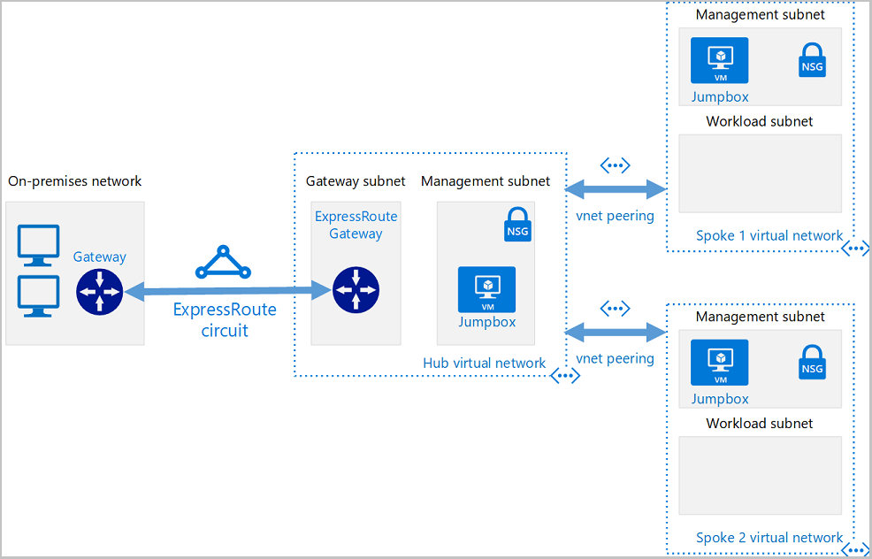

# Introduction

In this walkthrough, we will take a deep dive into how to deploy a hub-and-spoke network architecture in Azure with the help of Terraform. 

The following image demonstrates the components in a hub and spoke topology:


### **Understand Hub and Spoke Topology**
The hub and spoke topology is a network design that isolates workloads while sharing common services like identity and security. The hub is a central VNet connected to the on-premises network, and the spokes are VNets that peer with the hub.

**Hub-Spoke Use Cases**:
- The hub VNET could house certain services and resources that the isolated spoke networks each need to utilize. Workloads in different environments (e.g., development, testing, production) could utilize DNS, IDS, and/or AD DS.
- For organizations that require central control over security.

### **Configure Your Environment**
Before diving into Terraform, ensure your environment is set up with the necessary tools and access rights. This includes installing Terraform and configuring it to interact with Azure.

Components defined in the Terraform scripts we plan on deploying.

- **On-premises network.** A VNet in Azure will be used to simulate an on-premises local-area network running within an organization. 
- **VPN device.** Either a hardware appliance or software solution, a VPN device/service serves to provide external connectivity to the on-premises network.
- **Hub VNet.** The central point of connectivity to your on-premises network and a place to host services consumed by the different workloads hosted in the spoke VNets.
- **Gateway subnet.** The VNet gateways are held in the same subnet.
- **Spoke VNets.** Spokes are used to isolate workloads in their own VNets, managed separately from other spokes.
- **VNet peering.** Peering connections are non-transitive, low latency connections between VNets. Once peered, the VNets exchange traffic by using the Azure backbone. 

#### `main.tf`
```hcl
terraform {

  required_version = ">=0.12"

  required_providers {
    azurerm = {
      source  = "hashicorp/azurerm"
      version = "~>2.0"
    }
  }
}

provider "azurerm" {
  features {}
}
```
**Explanation**: 
* The `terraform` block sets the Terraform version to 0.12 or later and specifies the Azure Resource Manager (`azurerm`) provider with version 2.x.
* The `provider "azurerm"` block is simply means that no specific features are being enabled or configured.

#### `variables.tf`
Create a file named `variables.tf` to contain the project variables and insert the following code:

```hcl
variable "location" {
    description = "Location of the network"
    default     = "eastus"
}

variable "username" {
    description = "Username for Virtual Machines"
    default     = "azureuser"
}

variable "password" {
    description = "Password for Virtual Machines"
}

variable "vmsize" {
    description = "Size of the VMs"
    default     = "Standard_DS1_v2"
}
```
**Explanation**
The above doesn't need to be spelled out. It simply states what will be the default values moving forward when calling on these variables.

> Note: This walkthrough uses a password you enter when you calling `terraform plan`. In a real-world app, you might consider using a SSH public/private key pair. For more on this, see [How to use SSH keys with Windows on Azure](https://learn.microsoft.com/en-us/azure/virtual-machines/linux/ssh-from-windows).

## Create on-premises virtual network in Azure using Terraform: `on-prem.tf`

`on-prem.tf` file below implements an on-premises network in Azure. If looking to replace the sample network with a private virtual network, simply modify the subnet IP addresses.

* Implement an on-premises VNet in hub-spoke topology
* Create hub network appliance resources
* Create on-premises virtual machine
* Create on-premises virtual private network gateway

```hcl
locals {
    onprem-location       = "eastus"
    onprem-resource-group = "onprem-vnet-rg"
    prefix-onprem         = "onprem"
}

# Resource Group Creation
resource "azurerm_resource_group" "onprem-vnet-rg" {
    name     = local.onprem-resource-group
    location = local.onprem-location
}

# VIRTUAL NETWORKS
resource "azurerm_virtual_network" "onprem-vnet" {
    name                = "onprem-vnet"
    location            = azurerm_resource_group.onprem-vnet-rg.location
    resource_group_name = azurerm_resource_group.onprem-vnet-rg.name
    address_space       = ["192.168.0.0/16"]

    tags = {
    environment = local.prefix-onprem
    }
}

# SUBNETS
resource "azurerm_subnet" "onprem-gateway-subnet" {
    name                 = "GatewaySubnet"
    resource_group_name  = azurerm_resource_group.onprem-vnet-rg.name
    virtual_network_name = azurerm_virtual_network.onprem-vnet.name
    address_prefixes     = ["192.168.255.224/27"]
}


resource "azurerm_subnet" "onprem-mgmt" {
    name                 = "mgmt"
    resource_group_name  = azurerm_resource_group.onprem-vnet-rg.name
    virtual_network_name = azurerm_virtual_network.onprem-vnet.name
    address_prefixes     = ["192.168.1.128/25"]
}

# PUBLIC IPs
resource "azurerm_public_ip" "onprem-pip" {
    name                         = "${local.prefix-onprem}-pip"
    location            = azurerm_resource_group.onprem-vnet-rg.location
    resource_group_name = azurerm_resource_group.onprem-vnet-rg.name
    allocation_method   = "Dynamic"

    tags = {
        environment = local.prefix-onprem
    }
}

# NICs
resource "azurerm_network_interface" "onprem-nic" {
    name                 = "${local.prefix-onprem}-nic"
    location             = azurerm_resource_group.onprem-vnet-rg.location
    resource_group_name  = azurerm_resource_group.onprem-vnet-rg.name
    enable_ip_forwarding = true

    ip_configuration {
    name                          = local.prefix-onprem
    subnet_id                     = azurerm_subnet.onprem-mgmt.id
    private_ip_address_allocation = "Dynamic"
    public_ip_address_id          = azurerm_public_ip.onprem-pip.id
    }
}

# NETWORK SECURITY GROUP AND RULES
resource "azurerm_network_security_group" "onprem-nsg" {
    name                = "${local.prefix-onprem}-nsg"
    location            = azurerm_resource_group.onprem-vnet-rg.location
    resource_group_name = azurerm_resource_group.onprem-vnet-rg.name

    security_rule {
        name                       = "SSH"
        priority                   = 1001
        direction                  = "Inbound"
        access                     = "Allow"
        protocol                   = "Tcp"
        source_port_range          = "*"
        destination_port_range     = "22"
        source_address_prefix      = "*"
        destination_address_prefix = "*"
    }

    tags = {
        environment = "onprem"
    }
}

resource "azurerm_subnet_network_security_group_association" "mgmt-nsg-association" {
    subnet_id                 = azurerm_subnet.onprem-mgmt.id
    network_security_group_id = azurerm_network_security_group.onprem-nsg.id
}

# VIRTUAL MACHINE
resource "azurerm_virtual_machine" "onprem-vm" {
    name                  = "${local.prefix-onprem}-vm"
    location              = azurerm_resource_group.onprem-vnet-rg.location
    resource_group_name   = azurerm_resource_group.onprem-vnet-rg.name
    network_interface_ids = [azurerm_network_interface.onprem-nic.id]
    vm_size               = var.vmsize

    storage_image_reference {
    publisher = "Canonical"
    offer     = "UbuntuServer"
    sku       = "16.04-LTS"
    version   = "latest"
    }

    storage_os_disk {
    name              = "myosdisk1"
    caching           = "ReadWrite"
    create_option     = "FromImage"
    managed_disk_type = "Standard_LRS"
    }

    os_profile {
    computer_name  = "${local.prefix-onprem}-vm"
    admin_username = var.username
    admin_password = var.password
    }

    os_profile_linux_config {
    disable_password_authentication = false
    }

    tags = {
    environment = local.prefix-onprem
    }
}

# VPN GATEWAY PUBLIC IP
resource "azurerm_public_ip" "onprem-vpn-gateway1-pip" {
    name                = "${local.prefix-onprem}-vpn-gateway1-pip"
    location            = azurerm_resource_group.onprem-vnet-rg.location
    resource_group_name = azurerm_resource_group.onprem-vnet-rg.name

    allocation_method = "Dynamic"
}

# VIRTUAL NETWORK GATEWAY
resource "azurerm_virtual_network_gateway" "onprem-vpn-gateway" {
    name                = "onprem-vpn-gateway1"
    location            = azurerm_resource_group.onprem-vnet-rg.location
    resource_group_name = azurerm_resource_group.onprem-vnet-rg.name

    type     = "Vpn"
    vpn_type = "RouteBased"

    active_active = false
    enable_bgp    = false
    sku           = "VpnGw1"

    ip_configuration {
    name                          = "vnetGatewayConfig"
    public_ip_address_id          = azurerm_public_ip.onprem-vpn-gateway1-pip.id
    private_ip_address_allocation = "Dynamic"
    subnet_id                     = azurerm_subnet.onprem-gateway-subnet.id
    }
    depends_on = [azurerm_public_ip.onprem-vpn-gateway1-pip]

}
```
**Explantion**:
- The `locals` block defines local values that can be used throughout the script. 
- The `azurerm_resource_group` block creates a resource group in Azure.
- The `azurerm_virtual_network` block creates a virtual network in the resource group.
- The `azurerm_subnet` blocks create two subnets within the virtual network.
- The `azurerm_public_ip` block creates a public IP address.
- The `azurerm_network_interface` block creates a network interface and associates it with the subnet and public IP.
- The `azurerm_network_security_group` block creates a network security group with an inbound rule allowing SSH traffic.
- The `azurerm_subnet_network_security_group_association` block associates the network security group with the subnet.
- The `azurerm_virtual_machine` block creates a virtual machine and associates it with the network interface.
- The `azurerm_public_ip` block creates another public IP for the VPN gateway.
- The `azurerm_virtual_network_gateway` block creates a VPN gateway and associates it with the public IP and the gateway subnet.

This script sets up a network environment with a virtual machine and a VPN gateway, both of which are accessible via public IP addresses. The network security group allows SSH traffic to the virtual machine. The VPN gateway allows secure connections to the network. The entire setup is contained within a single resource group. The use of local values and variables allows for easy customization of the script.

**Explanation**: 
This block defines a Virtual Network (VNet) in Azure, which will act as the hub in our topology. It specifies the address space, location, and other parameters.


```hcl
# [ TERRAFORM CODE BLOCK FOR PEERING VNets]
```
**Explanation**: This code snippet establishes peering between the hub VNet and spoke VNets, allowing them to communicate and share services[^7^][7].


## Create a Hub Virtual Network
`hub-vnet.tf` file implements the "hub" in the hub-and-spoke topology.
- Create a hub jumpbox virtual machine.
- Create a hub virtual private network gateway.
- Create hub and on-premises gateway connections.

```hcl
locals {
    prefix-hub         = "hub"
    hub-location       = "eastus"
    hub-resource-group = "hub-vnet-rg"
    shared-key         = "4-v3ry-53cr37-1p53c-5h4r3d-k3y"
}

resource "azurerm_resource_group" "hub-vnet-rg" {
    name     = local.hub-resource-group
    location = local.hub-location
}

resource "azurerm_virtual_network" "hub-vnet" {
    name                = "${local.prefix-hub}-vnet"
    location            = azurerm_resource_group.hub-vnet-rg.location
    resource_group_name = azurerm_resource_group.hub-vnet-rg.name
    address_space       = ["10.0.0.0/16"]

    tags = {
    environment = "hub-spoke"
    }
}

resource "azurerm_subnet" "hub-gateway-subnet" {
    name                 = "GatewaySubnet"
    resource_group_name  = azurerm_resource_group.hub-vnet-rg.name
    virtual_network_name = azurerm_virtual_network.hub-vnet.name
    address_prefixes     = ["10.0.255.224/27"]
}

resource "azurerm_subnet" "hub-mgmt" {
    name                 = "mgmt"
    resource_group_name  = azurerm_resource_group.hub-vnet-rg.name
    virtual_network_name = azurerm_virtual_network.hub-vnet.name
    address_prefixes       = ["10.0.0.64/27"]
}

resource "azurerm_subnet" "hub-dmz" {
    name                 = "dmz"
    resource_group_name  = azurerm_resource_group.hub-vnet-rg.name
    virtual_network_name = azurerm_virtual_network.hub-vnet.name
    address_prefixes       = ["10.0.0.32/27"]
}

resource "azurerm_network_interface" "hub-nic" {
    name                 = "${local.prefix-hub}-nic"
    location             = azurerm_resource_group.hub-vnet-rg.location
    resource_group_name  = azurerm_resource_group.hub-vnet-rg.name
    enable_ip_forwarding = true

    ip_configuration {
    name                          = local.prefix-hub
    subnet_id                     = azurerm_subnet.hub-mgmt.id
    private_ip_address_allocation = "Dynamic"
    }

    tags = {
    environment = local.prefix-hub
    }
}

#Virtual Machine
resource "azurerm_virtual_machine" "hub-vm" {
    name                  = "${local.prefix-hub}-vm"
    location              = azurerm_resource_group.hub-vnet-rg.location
    resource_group_name   = azurerm_resource_group.hub-vnet-rg.name
    network_interface_ids = [azurerm_network_interface.hub-nic.id]
    vm_size               = var.vmsize

    storage_image_reference {
    publisher = "Canonical"
    offer     = "UbuntuServer"
    sku       = "16.04-LTS"
    version   = "latest"
    }

    storage_os_disk {
    name              = "myosdisk1"
    caching           = "ReadWrite"
    create_option     = "FromImage"
    managed_disk_type = "Standard_LRS"
    }

    os_profile {
    computer_name  = "${local.prefix-hub}-vm"
    admin_username = var.username
    admin_password = var.password
    }

    os_profile_linux_config {
    disable_password_authentication = false
    }

    tags = {
    environment = local.prefix-hub
    }
}

# Virtual Network Gateway
resource "azurerm_public_ip" "hub-vpn-gateway1-pip" {
    name                = "hub-vpn-gateway1-pip"
    location            = azurerm_resource_group.hub-vnet-rg.location
    resource_group_name = azurerm_resource_group.hub-vnet-rg.name

    allocation_method = "Dynamic"
}

resource "azurerm_virtual_network_gateway" "hub-vnet-gateway" {
    name                = "hub-vpn-gateway1"
    location            = azurerm_resource_group.hub-vnet-rg.location
    resource_group_name = azurerm_resource_group.hub-vnet-rg.name

    type     = "Vpn"
    vpn_type = "RouteBased"

    active_active = false
    enable_bgp    = false
    sku           = "VpnGw1"

    ip_configuration {
    name                          = "vnetGatewayConfig"
    public_ip_address_id          = azurerm_public_ip.hub-vpn-gateway1-pip.id
    private_ip_address_allocation = "Dynamic"
    subnet_id                     = azurerm_subnet.hub-gateway-subnet.id
    }
    depends_on = [azurerm_public_ip.hub-vpn-gateway1-pip]
}

resource "azurerm_virtual_network_gateway_connection" "hub-onprem-conn" {
    name                = "hub-onprem-conn"
    location            = azurerm_resource_group.hub-vnet-rg.location
    resource_group_name = azurerm_resource_group.hub-vnet-rg.name

    type           = "Vnet2Vnet"
    routing_weight = 1

    virtual_network_gateway_id      = azurerm_virtual_network_gateway.hub-vnet-gateway.id
    peer_virtual_network_gateway_id = azurerm_virtual_network_gateway.onprem-vpn-gateway.id

    shared_key = local.shared-key
}

resource "azurerm_virtual_network_gateway_connection" "onprem-hub-conn" {
    name                = "onprem-hub-conn"
    location            = azurerm_resource_group.onprem-vnet-rg.location
    resource_group_name = azurerm_resource_group.onprem-vnet-rg.name
    type                            = "Vnet2Vnet"
    routing_weight = 1
    virtual_network_gateway_id      = azurerm_virtual_network_gateway.onprem-vpn-gateway.id
    peer_virtual_network_gateway_id = azurerm_virtual_network_gateway.hub-vnet-gateway.id

    shared_key = local.shared-key
}
```
**Explanation**:

- `locals` block defines local values that can be used throughout the script.
- `azurerm_resource_group` block creates a resource group in Azure.
- `azurerm_virtual_network` block creates a virtual network in the resource group.
- `azurerm_subnet` blocks create three subnets within the virtual network.
- `azurerm_network_interface` block creates a network interface and associates it with the management subnet.
- `azurerm_virtual_machine` block creates a virtual machine and associates it with the network interface.
- `azurerm_public_ip` block creates a public IP for the VPN gateway.
- `azurerm_virtual_network_gateway` block creates a VPN gateway and associates it with the public IP and the gateway subnet.
- `azurerm_virtual_network_gateway_connection` blocks create VPN connections between the on-premises network and the hub network.

This script sets up a hub network environment with a virtual machine and a VPN gateway, both of which are accessible via public IP addresses. The network security group allows SSH traffic to the virtual machine. The VPN gateway allows secure connections to the network. The entire setup is contained within a single resource group. The use of local values and variables allows for easy customization of the script.

## Create a hub virtual network appliance in Azure using Terraform: `hub-nva.tf`

- Implement the Hub VNet in hub-spoke topology
- Create Hub Network Virtual Machine which acts as appliance
- Enable routes using CustomScript extensions
- Create Hub and Spoke gateway route tables

```hcl
locals {
    prefix-hub-nva         = "hub-nva"
    hub-nva-location       = "eastus"
    hub-nva-resource-group = "hub-nva-rg"
}

resource "azurerm_resource_group" "hub-nva-rg" {
    name     = "${local.prefix-hub-nva}-rg"
    location = local.hub-nva-location

    tags = {
    environment = local.prefix-hub-nva
    }
}

resource "azurerm_network_interface" "hub-nva-nic" {
    name                 = "${local.prefix-hub-nva}-nic"
    location             = azurerm_resource_group.hub-nva-rg.location
    resource_group_name  = azurerm_resource_group.hub-nva-rg.name
    enable_ip_forwarding = true

    ip_configuration {
    name                          = local.prefix-hub-nva
    subnet_id                     = azurerm_subnet.hub-dmz.id
    private_ip_address_allocation = "Static"
    private_ip_address            = "10.0.0.36"
    }

    tags = {
    environment = local.prefix-hub-nva
    }
}

resource "azurerm_virtual_machine" "hub-nva-vm" {
    name                  = "${local.prefix-hub-nva}-vm"
    location              = azurerm_resource_group.hub-nva-rg.location
    resource_group_name   = azurerm_resource_group.hub-nva-rg.name
    network_interface_ids = [azurerm_network_interface.hub-nva-nic.id]
    vm_size               = var.vmsize

    storage_image_reference {
    publisher = "Canonical"
    offer     = "UbuntuServer"
    sku       = "16.04-LTS"
    version   = "latest"
    }

    storage_os_disk {
    name              = "myosdisk1"
    caching           = "ReadWrite"
    create_option     = "FromImage"
    managed_disk_type = "Standard_LRS"
    }

    os_profile {
    computer_name  = "${local.prefix-hub-nva}-vm"
    admin_username = var.username
    admin_password = var.password
    }

    os_profile_linux_config {
    disable_password_authentication = false
    }

    tags = {
    environment = local.prefix-hub-nva
    }
}

resource "azurerm_virtual_machine_extension" "enable-routes" {
    name                 = "enable-iptables-routes"
    virtual_machine_id   = azurerm_virtual_machine.hub-nva-vm.id
    publisher            = "Microsoft.Azure.Extensions"
    type                 = "CustomScript"
    type_handler_version = "2.0"


    settings = <<SETTINGS
    {
        "fileUris": [
        "https://raw.githubusercontent.com/mspnp/reference-architectures/master/scripts/linux/enable-ip-forwarding.sh"
        ],
        "commandToExecute": "bash enable-ip-forwarding.sh"
    }
SETTINGS

    tags = {
    environment = local.prefix-hub-nva
    }
}

resource "azurerm_route_table" "hub-gateway-rt" {
    name                          = "hub-gateway-rt"
    location                      = azurerm_resource_group.hub-nva-rg.location
    resource_group_name           = azurerm_resource_group.hub-nva-rg.name
    disable_bgp_route_propagation = false

    route {
    name           = "toHub"
    address_prefix = "10.0.0.0/16"
    next_hop_type  = "VnetLocal"
    }

    route {
    name                   = "toSpoke1"
    address_prefix         = "10.1.0.0/16"
    next_hop_type          = "VirtualAppliance"
    next_hop_in_ip_address = "10.0.0.36"
    }

    route {
    name                   = "toSpoke2"
    address_prefix         = "10.2.0.0/16"
    next_hop_type          = "VirtualAppliance"
    next_hop_in_ip_address = "10.0.0.36"
    }

    tags = {
    environment = local.prefix-hub-nva
    }
}

resource "azurerm_subnet_route_table_association" "hub-gateway-rt-hub-vnet-gateway-subnet" {
    subnet_id      = azurerm_subnet.hub-gateway-subnet.id
    route_table_id = azurerm_route_table.hub-gateway-rt.id
    depends_on = [azurerm_subnet.hub-gateway-subnet]
}

resource "azurerm_route_table" "spoke1-rt" {
    name                          = "spoke1-rt"
    location                      = azurerm_resource_group.hub-nva-rg.location
    resource_group_name           = azurerm_resource_group.hub-nva-rg.name
    disable_bgp_route_propagation = false

    route {
    name                   = "toSpoke2"
    address_prefix         = "10.2.0.0/16"
    next_hop_type          = "VirtualAppliance"
    next_hop_in_ip_address = "10.0.0.36"
    }

    route {
    name           = "default"
    address_prefix = "0.0.0.0/0"
    next_hop_type  = "vnetlocal"
    }

    tags = {
    environment = local.prefix-hub-nva
    }
}

resource "azurerm_subnet_route_table_association" "spoke1-rt-spoke1-vnet-mgmt" {
    subnet_id      = azurerm_subnet.spoke1-mgmt.id
    route_table_id = azurerm_route_table.spoke1-rt.id
    depends_on = [azurerm_subnet.spoke1-mgmt]
}

resource "azurerm_subnet_route_table_association" "spoke1-rt-spoke1-vnet-workload" {
    subnet_id      = azurerm_subnet.spoke1-workload.id
    route_table_id = azurerm_route_table.spoke1-rt.id
    depends_on = [azurerm_subnet.spoke1-workload]
}

resource "azurerm_route_table" "spoke2-rt" {
    name                          = "spoke2-rt"
    location                      = azurerm_resource_group.hub-nva-rg.location
    resource_group_name           = azurerm_resource_group.hub-nva-rg.name
    disable_bgp_route_propagation = false

    route {
    name                   = "toSpoke1"
    address_prefix         = "10.1.0.0/16"
    next_hop_in_ip_address = "10.0.0.36"
    next_hop_type          = "VirtualAppliance"
    }

    route {
    name           = "default"
    address_prefix = "0.0.0.0/0"
    next_hop_type  = "vnetlocal"
    }

    tags = {
    environment = local.prefix-hub-nva
    }
}

resource "azurerm_subnet_route_table_association" "spoke2-rt-spoke2-vnet-mgmt" {
    subnet_id      = azurerm_subnet.spoke2-mgmt.id
    route_table_id = azurerm_route_table.spoke2-rt.id
    depends_on = [azurerm_subnet.spoke2-mgmt]
}

resource "azurerm_subnet_route_table_association" "spoke2-rt-spoke2-vnet-workload" {
    subnet_id      = azurerm_subnet.spoke2-workload.id
    route_table_id = azurerm_route_table.spoke2-rt.id
    depends_on = [azurerm_subnet.spoke2-workload]
}
```
**Explanation**:
- `locals` block defines local values that can be used throughout the script.
- `azurerm_resource_group` block creates a resource group in Azure.
- `azurerm_network_interface` block creates a network interface and associates it with the DMZ subnet.
- `azurerm_virtual_machine` block creates a virtual machine and associates it with the network interface.
- `azurerm_virtual_machine_extension` block enables IP forwarding on the virtual machine.
- `azurerm_route_table` blocks create route tables for the hub gateway and the spoke networks.
- `azurerm_subnet_route_table_association` blocks associate the route tables with the respective subnets.

This script sets up a hub network environment with a virtual machine and a VPN gateway, both of which are accessible via public IP addresses. The network security group allows SSH traffic to the virtual machine. The VPN gateway allows secure connections to the network. The entire setup is contained within a single resource group. The use of local values and variables allows for easy customization of the script. The route tables ensure that traffic is routed correctly between the hub and spoke networks. The virtual machine extension enables IP forwarding, allowing the virtual machine to forward traffic between networks.

## Creating Spoke Networks: `spoke1.tf` and `spoke2.tf`
- Implement the Spoke VNets in hub-spoke topology
- Create Virtual machines in the spoke networks
- Establish virtual network peerings with the hub networks

Below is the implementation of two separate spoke networks to demonstrate separation of workloads. The networks share common resources using hub virtual network. Spokes can be used to isolate workloads in their own VNets, managed separately from other spokes. Each workload might include multiple tiers, with multiple subnets connected through Azure load balancers

`spoke1.tf` 
```hcl
locals {
    spoke1-location       = "eastus"
    spoke1-resource-group = "spoke1-vnet-rg"
    prefix-spoke1         = "spoke1"
}

resource "azurerm_resource_group" "spoke1-vnet-rg" {
    name     = local.spoke1-resource-group
    location = local.spoke1-location
}

resource "azurerm_virtual_network" "spoke1-vnet" {
    name                = "spoke1-vnet"
    location            = azurerm_resource_group.spoke1-vnet-rg.location
    resource_group_name = azurerm_resource_group.spoke1-vnet-rg.name
    address_space       = ["10.1.0.0/16"]

    tags = {
    environment = local.prefix-spoke1
    }
}

resource "azurerm_subnet" "spoke1-mgmt" {
    name                 = "mgmt"
    resource_group_name  = azurerm_resource_group.spoke1-vnet-rg.name
    virtual_network_name = azurerm_virtual_network.spoke1-vnet.name
    address_prefixes     = ["10.1.0.64/27"]
}

resource "azurerm_subnet" "spoke1-workload" {
    name                 = "workload"
    resource_group_name  = azurerm_resource_group.spoke1-vnet-rg.name
    virtual_network_name = azurerm_virtual_network.spoke1-vnet.name
    address_prefixes     = ["10.1.1.0/24"]
}

resource "azurerm_virtual_network_peering" "spoke1-hub-peer" {
    name                      = "spoke1-hub-peer"
    resource_group_name       = azurerm_resource_group.spoke1-vnet-rg.name
    virtual_network_name      = azurerm_virtual_network.spoke1-vnet.name
    remote_virtual_network_id = azurerm_virtual_network.hub-vnet.id

    allow_virtual_network_access = true
    allow_forwarded_traffic = true
    allow_gateway_transit   = false
    use_remote_gateways     = true
    depends_on = [azurerm_virtual_network.spoke1-vnet, azurerm_virtual_network.hub-vnet , azurerm_virtual_network_gateway.hub-vnet-gateway]
}

resource "azurerm_network_interface" "spoke1-nic" {
    name                 = "${local.prefix-spoke1}-nic"
    location             = azurerm_resource_group.spoke1-vnet-rg.location
    resource_group_name  = azurerm_resource_group.spoke1-vnet-rg.name
    enable_ip_forwarding = true

    ip_configuration {
    name                          = local.prefix-spoke1
    subnet_id                     = azurerm_subnet.spoke1-mgmt.id
    private_ip_address_allocation = "Dynamic"
    }
}

resource "azurerm_virtual_machine" "spoke1-vm" {
    name                  = "${local.prefix-spoke1}-vm"
    location              = azurerm_resource_group.spoke1-vnet-rg.location
    resource_group_name   = azurerm_resource_group.spoke1-vnet-rg.name
    network_interface_ids = [azurerm_network_interface.spoke1-nic.id]
    vm_size               = var.vmsize

    storage_image_reference {
    publisher = "Canonical"
    offer     = "UbuntuServer"
    sku       = "16.04-LTS"
    version   = "latest"
    }

    storage_os_disk {
    name              = "myosdisk1"
    caching           = "ReadWrite"
    create_option     = "FromImage"
    managed_disk_type = "Standard_LRS"
    }

    os_profile {
    computer_name  = "${local.prefix-spoke1}-vm"
    admin_username = var.username
    admin_password = var.password
    }

    os_profile_linux_config {
    disable_password_authentication = false
    }

    tags = {
    environment = local.prefix-spoke1
    }
}

resource "azurerm_virtual_network_peering" "hub-spoke1-peer" {
    name                      = "hub-spoke1-peer"
    resource_group_name       = azurerm_resource_group.hub-vnet-rg.name
    virtual_network_name      = azurerm_virtual_network.hub-vnet.name
    remote_virtual_network_id = azurerm_virtual_network.spoke1-vnet.id
    allow_virtual_network_access = true
    allow_forwarded_traffic   = true
    allow_gateway_transit     = true
    use_remote_gateways       = false
    depends_on = [azurerm_virtual_network.spoke1-vnet, azurerm_virtual_network.hub-vnet, azurerm_virtual_network_gateway.hub-vnet-gateway]
}
```
`spoke2.tf`
```hcl
locals {
    spoke2-location       = "eastus"
    spoke2-resource-group = "spoke2-vnet-rg"
    prefix-spoke2         = "spoke2"
}

resource "azurerm_resource_group" "spoke2-vnet-rg" {
    name     = local.spoke2-resource-group
    location = local.spoke2-location
}

resource "azurerm_virtual_network" "spoke2-vnet" {
    name                = "${local.prefix-spoke2}-vnet"
    location            = azurerm_resource_group.spoke2-vnet-rg.location
    resource_group_name = azurerm_resource_group.spoke2-vnet-rg.name
    address_space       = ["10.2.0.0/16"]

    tags = {
    environment = local.prefix-spoke2
    }
}

resource "azurerm_subnet" "spoke2-mgmt" {
    name                 = "mgmt"
    resource_group_name  = azurerm_resource_group.spoke2-vnet-rg.name
    virtual_network_name = azurerm_virtual_network.spoke2-vnet.name
    address_prefixes     = ["10.2.0.64/27"]
}

resource "azurerm_subnet" "spoke2-workload" {
    name                 = "workload"
    resource_group_name  = azurerm_resource_group.spoke2-vnet-rg.name
    virtual_network_name = azurerm_virtual_network.spoke2-vnet.name
    address_prefixes     = ["10.2.1.0/24"]
}

resource "azurerm_virtual_network_peering" "spoke2-hub-peer" {
    name                      = "${local.prefix-spoke2}-hub-peer"
    resource_group_name       = azurerm_resource_group.spoke2-vnet-rg.name
    virtual_network_name      = azurerm_virtual_network.spoke2-vnet.name
    remote_virtual_network_id = azurerm_virtual_network.hub-vnet.id

    allow_virtual_network_access = true
    allow_forwarded_traffic = true
    allow_gateway_transit   = false
    use_remote_gateways     = true
    depends_on = [azurerm_virtual_network.spoke2-vnet, azurerm_virtual_network.hub-vnet, azurerm_virtual_network_gateway.hub-vnet-gateway]
}

resource "azurerm_network_interface" "spoke2-nic" {
    name                 = "${local.prefix-spoke2}-nic"
    location             = azurerm_resource_group.spoke2-vnet-rg.location
    resource_group_name  = azurerm_resource_group.spoke2-vnet-rg.name
    enable_ip_forwarding = true

    ip_configuration {
    name                          = local.prefix-spoke2
    subnet_id                     = azurerm_subnet.spoke2-mgmt.id
    private_ip_address_allocation = "Dynamic"
    }

    tags = {
    environment = local.prefix-spoke2
    }
}

resource "azurerm_virtual_machine" "spoke2-vm" {
    name                  = "${local.prefix-spoke2}-vm"
    location              = azurerm_resource_group.spoke2-vnet-rg.location
    resource_group_name   = azurerm_resource_group.spoke2-vnet-rg.name
    network_interface_ids = [azurerm_network_interface.spoke2-nic.id]
    vm_size               = var.vmsize

    storage_image_reference {
    publisher = "Canonical"
    offer     = "UbuntuServer"
    sku       = "16.04-LTS"
    version   = "latest"
    }

    storage_os_disk {
    name              = "myosdisk1"
    caching           = "ReadWrite"
    create_option     = "FromImage"
    managed_disk_type = "Standard_LRS"
    }

    os_profile {
    computer_name  = "${local.prefix-spoke2}-vm"
    admin_username = var.username
    admin_password = var.password
    }

    os_profile_linux_config {
    disable_password_authentication = false
    }

    tags = {
    environment = local.prefix-spoke2
    }
}

resource "azurerm_virtual_network_peering" "hub-spoke2-peer" {
    name                      = "hub-spoke2-peer"
    resource_group_name       = azurerm_resource_group.hub-vnet-rg.name
    virtual_network_name      = azurerm_virtual_network.hub-vnet.name
    remote_virtual_network_id = azurerm_virtual_network.spoke2-vnet.id
    allow_virtual_network_access = true
    allow_forwarded_traffic   = true
    allow_gateway_transit     = true
    use_remote_gateways       = false
    depends_on = [azurerm_virtual_network.spoke2-vnet, azurerm_virtual_network.hub-vnet, azurerm_virtual_network_gateway.hub-vnet-gateway]
}
```
**Explanation**:

- `locals` block defines local values that can be used throughout the script.
- `azurerm_resource_group` block creates a resource group in Azure.
`azurerm_virtual_network` block creates a virtual network in the resource group.
- `azurerm_subnet` blocks create two subnets within the virtual network.
- `azurerm_virtual_network_peering` block creates a peering connection between the spoke1 network and the hub network.
- `azurerm_network_interface` block creates a network interface and associates it with the management subnet.
- `azurerm_virtual_machine` block creates a virtual machine and associates it with the network interface.
- `azurerm_virtual_network_peering` block creates a peering connection from the hub network to the spoke1 network.

This script sets up a spoke network environment with a virtual machine that is accessible via a network interface. The virtual network peering allows the spoke network to communicate with the hub network. The entire setup is contained within a single resource group. The use of local values and variables allows for easy customization of the script. The virtual machine can be accessed via SSH for management purposes.

## Validate a hub and spoke network in Azure using Terraform

- Verify the resources to be deployed
- Create the resources in Azure
- Verify the connectivity between different networks

Let's execute the terraform files created. The result is a validation of the connectivity between the demo virtual networks.

Breakdown of the files created:

| File Name | Section |
| --- | --- |
| `main.tf`      | Create a hub and spoke hybrid network topology |
| `variables.tf` | Create a hub and spoke hybrid network topology |
| `on-prem.tf`   | Create on-premises virtual network |
| `hub-vnet.tf`  | Create a hub virtual network with |
| `hub-nva.tf`   | Create a hub virtual network appliance |
| `spoke1.tf`    | Create poke virtual networks |
| `spoke2.tf`    | Create a spoke virtual networks |

### Steps to Deploy

#### Initialize Terraform

Run [`terraform init`](https://www.terraform.io/docs/commands/init.html) to initialize the Terraform deployment. This command downloads the Azure provider required to manage your Azure resources. 

```console
terraform init -upgrade
```
`-upgrade` parameter upgrades the necessary provider plugins to the newest version that complies with the configuration's version constraints.

#### Create and Review the Terraform Execution Plan

Running [`terraform plan`](https://www.terraform.io/docs/commands/plan.html) creates an execution plan.

```console
terraform plan -out main.tfplan
```

- `terraform plan`: This command creates an execution plan but doesn't apply it. It determines the necessary actions to achieve the configuration specified in your Terraform files. This allows you to verify if the execution plan aligns with your expectations before making any changes to the actual resources.
- `-out` parameter: This optional parameter allows you to specify an output file for the plan. Using `-out` ensures that the plan you reviewed is exactly what gets applied when you run `terraform apply`.
This way, you can ensure that your infrastructure changes are predictable and controlled. It's a good practice to always review the plan before applying it to avoid any unexpected changes.

#### Apply the Terraform Execution Plan 

```console
terraform apply main.tfplan
```

- `terraform apply`: This command applies the execution plan to your cloud infrastructure. It makes the actual changes to reach the desired state described in your Terraform configuration files.

- `terraform apply main.tfplan`: This example command assumes you previously ran `terraform plan -out main.tfplan`. It applies the execution plan stored in the `main.tfplan` file.

- If you specified a different filename for the `-out` parameter when you ran `terraform plan`, you should use that same filename in the call to `terraform apply`.

Choosing not to include the `-out` parameter when you running `terraform plan` will result in the automatic creation and application of an execution plan. That is, no initial review. 

#### Verification and Testing
Time to verify the results of the Terraform deployment.

1. **Navigate to the resource group in the Azure portal**: Log in to your Azure account drill down the `onprem-vnet-rg` resource group page.

2. **Select the VM**: Within the `onprem-vnet-rg` resource group, select the VM named `onprem-vm`.

3. **Note the Public IP Address**: Take note of the Public IP Address value of the `onprem-vm`.

4. **SSH into the VM**: Return to the command line and run the following command to connect to the simulated on-premises environment via SSH:
    ```bash
    ssh azureuser@<onprem_vm_ip_address>
    ```
   Replace `<onprem_vm_ip_address>` with the Public IP Address you noted earlier. If you changed the username from `azureuser` in the `variables.tf` file, make sure to use that username in the SSH command. Use the password you specified when you ran `terraform plan`.

5. **Test connectivity to the hub VNet**: Once connected to the `onprem-vm` virtual machine, run the following command to test connectivity to the jumpbox VM in the hub VNet:
    ```bash
    ping 10.0.0.68
    ```

6. **Test connectivity to the spoke VMs**: Run the following commands to test connectivity to the jumpbox VMs in each spoke:
    ```bash
    ping 10.1.0.68
    ping 10.2.0.68
    ```

7. **Exit the SSH session**: To exit the SSH session on the `onprem-vm` virtual machine, enter `exit` and press `Enter`.

These steps help you verify that your Terraform deployment was successful and that the created resources are functioning as expected.

#### Clean up resources
With the exercise complete, feel free to clean up the the resources created via Terraform:

1. **Run `terraform plan` with the `-destroy` flag**: 
  ```bash
      terraform plan -destroy -out main.destroy.tfplan
  ```
This command creates an execution plan for destroying the resources specified in your Terraform configuration files. It doesn't execute the plan, but instead determines what actions are necessary to destroy the resources. This allows you to verify whether the execution plan matches your expectations before making any changes to actual resources.

2. **Run `terraform apply` to apply the execution plan**: This command applies the execution plan stored in the `main.destroy.tfplan` file, effectively destroying the resources.

    ```bash
    terraform apply main.destroy.tfplan
    ```

# Conclusion

In this blog post, we've walked through the process of deploying a hub and spoke architecture in Azure using Terraform. We've seen how Terraform's declarative language allows us to describe our desired infrastructure setup and then automatically handles the creation and configuration of those resources.

We started with an overview of the hub and spoke topology and its benefits for isolating workloads while sharing common services. We then dove into the specifics of creating and configuring resources in Azure using Terraform, including virtual networks, subnets, network interfaces, and virtual machines.

We also discussed the importance of planning and reviewing our Terraform execution plan before applying it, ensuring that our infrastructure changes are predictable and controlled. We learned how to use the `terraform plan` and `terraform apply` commands, and how to clean up our resources when they're no longer needed with `terraform destroy`.

Finally, we verified our setup by testing connectivity between our on-premises environment and the hub VNet, as well as between the hub and spoke networks.

By following this guide, you should now have a solid understanding of how to use Terraform to deploy a hub and spoke architecture in Azure. This knowledge will serve as a strong foundation for managing and automating your cloud infrastructure.

Remember, while this post provides a good starting point, the real power of Terraform lies in its flexibility and extensibility. Don't hesitate to explore the Terraform documentation and experiment with different resources and configurations to suit your specific needs.

Thank you for reading, and happy Terraforming!

## Troubleshooting Problems
If you run into any problems, please be sure to reference the [Troubleshoot common problems when using Terraform on Azure page](https://learn.microsoft.com/en-us/azure/developer/terraform/troubleshoot).

