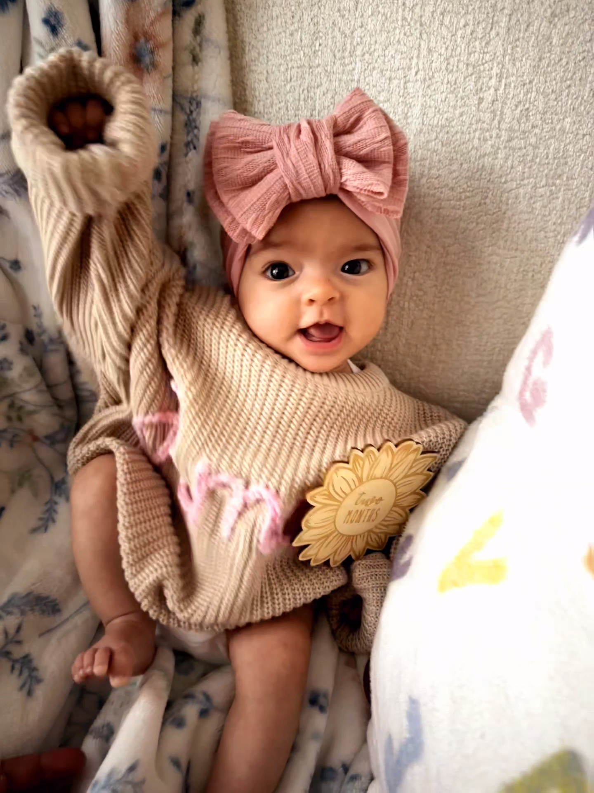

---
# the default layout is 'page'
icon: fas fa-info-circle
order: 4
---
## About Me

I'm Francisco Carmona, a cloud networking engineer that's been building on my foundational knowledge, learning to master the principles of artificial intelligence and machine learning so to the enhance data-driven decision-making processes.

I graduated from [Illinois State University](https://illinoisstate.edu/) with a B.S. in [Computer Systems Technology](https://illinoisstate.edu/academics/computer-systems-technology/).

My most recent position was with Microsoft as an Azure Networking Support Engineer. I was survived a few rounds of layoffs within our team and managed to fulfill my 18-month contract at the end of January. Seeing as my wife was due in mid February, things couldn't have lined up any better.

While I may have stepped away from work to care for my wife and our adorable baby girl, I've continued to pursue an interest in AI that was first sparked about a year ago. It started off as a small Microsoft provided introductory course on AI. More than a year removed since, I've now find myself developing web apps that utilize deep learning techniques to detect signs of pneumonia given a single x-ray image of a patient's lungs, a chatbot that answers questions from user provided PDFs, and even a text analyzer that determines if tweets (or whatever they're called now) are disaster related.

Forever curious, I find myself compelled to continually broaden my knowledge base.

I'm a big basketball fan. My wife always buys us tickets to watch at least one [Bulls](https://www.nba.com/bulls/) game a year. They've won every time we've gone, so I guess should be pressing for some season tickets...

So you still want to know more...

Well, I guess can rattle off some one liners:

    - I dabble in philosophy from time to time.
    - Thanks to people like Peter Zeihan, I've turned into a bit of a geopolitics nerd.
    - I like meditating. I actually find it kind of fun. That's right, fun.

And, like I said, I have a *very* adorable baby girl.

